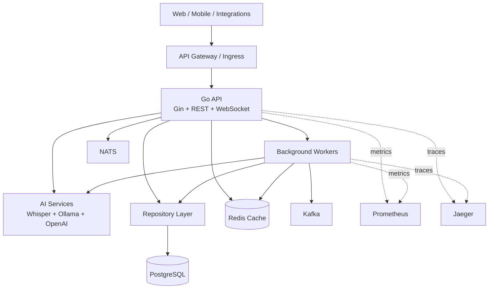

 


# Silent Meeting Summarizer

<p align="center">
  
</p>

<p align="center">
  <a href="https://github.com/Manikeshmk/GOlang/actions"></a>
  <a href="https://codecov.io/gh/Manikeshmk/GOlang"></a>
  <a href="https://goreportcard.com/report/github.com/Manikeshmk/GOlang"></a>
  <a href="LICENSE"></a>
  
</p>

<p align="center">
  
</p>

<p align="center">
  <b>A production-grade AI meeting assistant that records audio, performs speaker diarization, generates summaries, extracts action items, detects conflict, and keeps processing local-first with optional cloud AI.</b>
</p>

---

## Table of Contents

- [Why It Exists](#why-it-exists)
- [Feature Highlights](#feature-highlights)
- [Tech Stack](#tech-stack)
- [Architecture](#architecture)
- [Quick Start](#quick-start)
- [API Endpoints](#api-endpoints)
- [Project Structure](#project-structure)
- [Docker Services](#docker-services)
- [Testing](#testing)
- [Monitoring](#monitoring)
- [Security](#security)
- [Deployment](#deployment)
- [Documentation](#documentation)
- [Contributing](#contributing)

## Why It Exists

Meetings create a lot of information, but most of it is hard to reuse: scattered decisions, unclear ownership, repeated topics, unresolved disagreements, and minutes that arrive too late. Silent Meeting Summarizer turns meeting audio into structured intelligence:

- clear summaries for different audiences
- speaker-aware transcripts
- decisions with confidence signals
- action items with owners and due dates
- conflict, confusion, sentiment, and repeated-topic analysis
- local-first AI pipelines with optional OpenAI/Ollama integrations

## Feature Highlights

<table>
  <tr>
    <td width="50%">
      <h3>Audio Intelligence</h3>
      <ul>
        <li>Real-time streamed audio ingestion</li>
        <li>Buffering and backpressure handling</li>
        <li>Speech-to-text with provider fallback</li>
        <li>Speaker diarization and participant tracking</li>
      </ul>
    </td>
    <td width="50%">
      <h3>Meeting Understanding</h3>
      <ul>
        <li>Concise, detailed, and executive summaries</li>
        <li>Task extraction with owners and deadlines</li>
        <li>Decision confidence analysis</li>
        <li>Topic clustering and wasted-time estimation</li>
      </ul>
    </td>
  </tr>
  <tr>
    <td width="50%">
      <h3>Risk Signals</h3>
      <ul>
        <li>Conflict detection and disagreement scoring</li>
        <li>Unresolved topic identification</li>
        <li>Confusion and clarification-request detection</li>
        <li>Sentiment tracking across the meeting</li>
      </ul>
    </td>
    <td width="50%">
      <h3>Production Foundation</h3>
      <ul>
        <li>JWT authentication and RBAC</li>
        <li>Prometheus metrics and Jaeger tracing</li>
        <li>Docker and Kubernetes manifests</li>
        <li>Structured logging and health checks</li>
      </ul>
    </td>
  </tr>
</table>

## Tech Stack

### Backend

<p>
  
  
  
  
  
</p>

### Data and Messaging

<p>
  
  
  
  
  
</p>

### AI and Observability

<p>
  
  
  
  
  
</p>

### Frontend and Platform

<p>
  
  
  
  
  
  
  
</p>

## Architecture



## Quick Start

### Prerequisites

- Go 1.23+
- Docker and Docker Compose
- PostgreSQL 16+
- Redis 7+
- Node.js 18+ for the frontend

### Local Development

```bash
git clone https://github.com/Manikeshmk/GOlang.git
cd GOlang
cp .env.example .env
go mod download
make install-deps
make docker-up
make run
```

The API runs at:

```text
http://localhost:8080
```

### Docker Workflow

```bash
make docker-build
make docker-up
make docker-logs
make docker-down
```

## API Endpoints

### Authentication

| Method | Endpoint | Description |
| --- | --- | --- |
| `POST` | `/auth/register` | Register a new user |
| `POST` | `/auth/login` | Login and receive a JWT |

### Meetings

| Method | Endpoint | Description |
| --- | --- | --- |
| `POST` | `/meetings` | Create a meeting |
| `GET` | `/meetings` | List user meetings |
| `GET` | `/meetings/{id}` | Get meeting details |
| `POST` | `/meetings/{id}/end` | End a meeting |

### Analysis

| Method | Endpoint | Description |
| --- | --- | --- |
| `GET` | `/meetings/{meetingId}/summary` | Get generated summary |
| `GET` | `/meetings/{meetingId}/tasks` | Get extracted action items |
| `POST` | `/meetings/{meetingId}/tasks` | Create a task manually |
| `GET` | `/meetings/{meetingId}/conflicts` | Get detected conflicts |
| `GET` | `/meetings/{meetingId}/decisions` | Get meeting decisions |

## Project Structure

```text
.
|-- cmd/
|   |-- api/                 # API server entry point
|   `-- worker/              # Background workers
|-- internal/
|   |-- ai/                  # AI/ML services
|   |-- audio/               # Audio processing
|   |-- config/              # Configuration
|   |-- domain/              # Domain models
|   |-- handler/             # HTTP handlers
|   |-- logger/              # Logging
|   |-- middleware/          # HTTP middleware
|   |-- metrics/             # Prometheus metrics
|   |-- repository/          # Data access
|   |-- service/             # Business logic
|   `-- streaming/           # WebSocket/gRPC streaming
|-- api/proto/               # Protocol Buffer definitions
|-- db/migrations/           # Database migrations
|-- deployments/
|   |-- docker/              # Docker files and compose
|   `-- kubernetes/          # Kubernetes manifests
|-- web/frontend/            # Next.js frontend
|-- tests/                   # Unit and integration tests
|-- scripts/                 # Helper scripts
`-- docs/                    # Project documentation
```

## Docker Services

| Service | Purpose | Default Port |
| --- | --- | --- |
| API | Go application server | `8080` |
| PostgreSQL | Primary database | `5432` |
| Redis | Cache and sessions | `6379` |
| NATS | Lightweight messaging | `4222` |
| Kafka | Event streaming | `9092` |
| ZooKeeper | Kafka coordination | `2181` |
| Ollama | Local LLM runtime | `11434` |
| Prometheus | Metrics collection | `9090` |
| Jaeger | Distributed tracing | `16686` |

## Database Schema

```sql
users              -- User accounts
meetings           -- Meeting sessions
transcripts        -- Speech-to-text output
speakers           -- Unique meeting participants
summaries          -- AI-generated summaries
tasks              -- Extracted action items
decisions          -- Decision records
conflicts          -- Detected disagreements
confusions         -- Confusion signals
repeated_topics    -- Topic clustering results
```

## Testing

```bash
make test
make test-unit
make test-integration
make coverage
go test -race ./...
go test -bench=. ./...
```

## Monitoring

| Tool | URL | Use |
| --- | --- | --- |
| Prometheus | `http://localhost:9090` | Metrics, latency, error rates, runtime stats |
| Jaeger | `http://localhost:16686` | Distributed traces and request flow |
| API Health | `http://localhost:8080/health` | Service readiness |

```bash
curl http://localhost:8080/health
```

## Security

- JWT token-based authentication
- Role-based access control
- Input validation and sanitization
- Encrypted database connections
- CORS protection
- Rate limiting middleware
- Non-root Docker containers
- Kubernetes security policies
- Environment-based secret management

```bash
cp .env.example .env

kubectl create secret generic summarizer-secrets \
  --from-literal=db_password=secure_password \
  --from-literal=jwt_secret=secure_secret
```

## Deployment

### Local Binary

```bash
make build
./bin/summarizer-api
```

### Docker

```bash
make docker-build
make docker-up
```

### Kubernetes

```bash
kubectl create namespace meeting-summarizer
kubectl apply -f deployments/kubernetes/
kubectl get pods -n meeting-summarizer
```

### Production Checklist

- [ ] Rotate `JWT_SECRET`
- [ ] Change database credentials
- [ ] Enable HTTPS/TLS
- [ ] Configure production domain name
- [ ] Set up automated backups
- [ ] Enable centralized log aggregation
- [ ] Configure alert thresholds
- [ ] Review RBAC policies
- [ ] Test disaster recovery

## Development Commands

| Command | Description |
| --- | --- |
| `make fmt` | Format Go code |
| `make lint` | Run linter |
| `make vet` | Run Go vet |
| `make security-check` | Run security scan |
| `make build` | Build API binary |
| `make dev` | Run development server with auto-reload |
| `make docs` | Generate API docs |
| `make docker-logs` | Tail API container logs |

## Environment Variables

```env
SERVER_PORT=8080
ENVIRONMENT=production

DB_HOST=localhost
DB_NAME=meeting_summarizer
DB_USER=postgres
DB_PASSWORD=secure_password

REDIS_HOST=localhost
JWT_SECRET=your-secret-key

WHISPER_MODEL=base
OLLAMA_URL=http://localhost:11434
OPENAI_API_KEY=sk-...

NATS_URL=nats://localhost:4222
KAFKA_URL=localhost:9092
```

See [.env.example](.env.example) for the complete configuration.

## Documentation

- [API Documentation](docs/API.md)
- [Architecture Guide](docs/ARCHITECTURE.md)
- [Deployment Guide](docs/DEPLOYMENT.md)
- [Development Guide](docs/DEVELOPMENT.md)
- [Contributing Guidelines](CONTRIBUTING.md)

## Troubleshooting

### Database Connection Failed

```bash
docker ps | grep postgres
```

Verify the database host, port, username, password, and database name in `.env`.

### Port Already in Use

```bash
lsof -i :8080
kill -9 <PID>
```

### Docker Issues

```bash
docker-compose -f deployments/docker/docker-compose.yml down -v
make docker-clean
make docker-build
```

## Contributing

Contributions are welcome. Please read [CONTRIBUTING.md](CONTRIBUTING.md), open an issue for larger changes, and keep pull requests focused.

## Acknowledgments

Built with the Go ecosystem, Gin, PostgreSQL, Redis, NATS, Kafka, Docker, Kubernetes, OpenAI Whisper, Ollama, Prometheus, Jaeger, Next.js, React, TypeScript, and Tailwind CSS.

## License

MIT License. See [LICENSE](LICENSE) for details.

---

<p align="center">
  <b>Latest Version:</b> 1.0.0 &nbsp;|&nbsp;
  <b>Last Updated:</b> 2026-05-09 &nbsp;|&nbsp;
  <b>Status:</b> Production Ready
</p>
